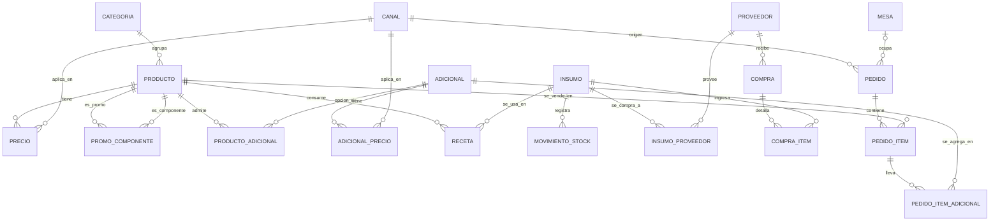

# Kainos: contexto del proyecto

Archivo pensado para que un agente de codigo (Claude en Warp / Claude Code) tome el contexto completo del proyecto al inicio de cada sesion. Si se renombra a `CLAUDE.md` en la raiz del repo, Claude Code lo lee automaticamente.

## 1. Que es esto

App full stack para **Kainos**, heladeria y cafeteria de la familia del usuario (Cristian, Ingeniero Electronico, Buenos Aires).

**El objetivo principal es aprender y practicar backend y frontend, no entregar rapido.** Hay usuarios reales (la familia), asi que la app tiene que servir de verdad, pero el proceso de aprendizaje manda.

Stack elegido:
- Backend: Node.js (Express o Fastify)
- Base de datos: PostgreSQL
- Frontend: React (Vite, React Router, TanStack Query)

Estado actual: PostgreSQL 18 instalado localmente (servicio `postgresql-x64-18`). Base `kainos_dev` creada. Bloque "Catalogo y precios" completo (`categoria`, `producto`, `canal`, `precio`, `adicional`, `producto_adicional`, `adicional_precio`, `promo_componente`). Del bloque de stock: `insumo`, `receta`, `proveedor`, `insumo_proveedor`, `compra`, `compra_item` ya creadas; falta `movimiento_stock` (se posterga a propósito hasta tener `PEDIDO_ITEM`, ver seccion 7). Todo a mano en `psql`/pgAdmin para practicar SQL. Todavia no hay codigo de backend/frontend. Bitacora detallada en `docs/bitacora.html`.

## 2. Reglas de trabajo para el agente

1. **Este es un proyecto de aprendizaje.** Antes de escribir codigo nuevo, proponer un plan y esperar aprobacion. No implementar rebanadas enteras sin que el usuario lo pida.
2. **Explicar el por que** de cada decision de diseno, con concision y precision tecnica.
3. **Senalar los puntos debiles con honestidad**: riesgos, inconsistencias, casos borde. No suavizar.
4. **SQL a mano primero** (driver directo, consultas escritas a mano). Un ORM (Prisma/Drizzle) solo si el usuario lo pide, para comparar.
5. **Migraciones versionadas.** Nunca editar una migracion ya aplicada; crear una nueva.
6. **Trabajar por rebanadas verticales**: cada feature se hace completa (tabla, endpoint, pantalla) antes de pasar a la siguiente.
7. **Validar con ejecucion real**: correr las consultas y los tests contra una base local con datos de prueba y mostrar los resultados.
8. **Nada destructivo sin confirmar**: no borrar tablas, no reescribir historial de git, no tocar credenciales. Usar siempre base local descartable.
9. Estructura en capas en el backend: rutas, controladores, servicios, acceso a datos. Validacion de entrada (zod o similar) y manejo de errores centralizado.
10. Idioma: espanol rioplatense en explicaciones y comentarios de documentacion.

## 3. Alcance

**Dentro del MVP:**
- Catalogo de productos con precios por canal y con vigencia
- Adicionales y promos (combos con componentes fijos)
- Stock de insumos con libro de movimientos
- Proveedores y compras (ingreso automatico de stock)
- Mesas (13) y pedidos (salon, mostrador, PedidosYa, Rappi)
- Descuento de stock por venta

**Fuera del MVP (backlog):**
- Facturacion fiscal (AFIP)
- Pagos online
- Integracion por API con PedidosYa/Rappi (en el MVP se cargan a mano con canal y precio de app)
- Promos complejas (2x1, descuentos porcentuales, horarios)
- Delivery propio, fidelizacion
- Modo offline

## 4. Requisitos de negocio (dichos por el usuario)

- Stock a llevar: helados (potes), comidas y bebidas.
- **Helados: control por pote entero**, no por bocha ni por gramos. Cada sabor es un insumo medido en potes.
- Promociones que incluyen comidas, bebidas, etc.
- Proveedores.
- 13 mesas; se puede agregar o quitar una mesa.
- Pedidos que llegan de aplicaciones (PedidosYa, Rappi).
- Los precios pueden cambiar con el tiempo.
- Hay adicionales (extras que se agregan a un producto).
- Precio especial para pedidos por **mostrador / para llevar** (por el packaging) y para **aplicaciones**.
- Stock automatico: se suma con cada compra a proveedor y se descuenta con la venta.

## 5. Decisiones de modelado tomadas

1. **Producto (lo que se vende) e insumo (lo que se compra y guarda) son cosas distintas.** Se relacionan por una receta.
2. **Sin precio en la tabla de productos.** Los precios viven en una tabla producto x canal x vigencia (`vigente_desde` / `vigente_hasta`; `vigente_hasta` nulo = vigente hoy). Un cambio de precio es una fila nueva.
3. **Precio congelado**: cada linea de pedido copia el precio vigente al momento de la venta (`precio_unit`). Igual para adicionales.
4. **Adicionales** con su propio precio por canal y vigencia; cada producto admite un subconjunto de adicionales.
5. **Promo = producto de tipo promo** con componentes (`PROMO_COMPONENTE`) y precio propio por canal (no es la suma de las partes). Al venderla se descuenta el stock de los componentes.
6. **Stock como libro de movimientos** (`MOVIMIENTO_STOCK`): filas inmutables con cantidad con signo. Tipos: `compra`, `venta`, `apertura`, `ajuste`, `merma`. `stock_actual` en insumo es un valor cacheado.
7. **Potes de helado**: no bajan por venta sino por movimiento `apertura` (cuando se abre un pote nuevo). El stock de helado dice cuantos potes cerrados quedan.
8. **Borrado logico** (`activo` / `activa`) en productos, adicionales, insumos y mesas; nunca borrado fisico, porque hay historial que los referencia.
9. **Anulaciones**: se revierten con movimientos nuevos de signo contrario, sin borrar los originales.
10. **Mesas**: un pedido abierto por mesa al que se le van agregando items. `mesa_id` nulo en mostrador y apps.
11. **El stock se descuenta al cerrar el pedido, no al agregar cada item.** Mientras el pedido esta `abierto`, agregar o sacar items es un simple INSERT/DELETE en `PEDIDO_ITEM` sin generar ni revertir movimientos de stock. Todo el descuento se hace de una vez, en una sola transaccion, al cerrar. Motivo: simplifica mucho el codigo (no hay que revertir nada si se saca un item de una mesa abierta). Riesgo asumido a conciencia: mientras dos mesas tienen pedidos abiertos, ninguna sabe que la otra esta "comprometiendo" el mismo insumo — si el ultimo poco de stock se vende por partida doble, no se detecta hasta el cierre. Aceptable para el volumen de un local familiar de 13 mesas; no lo seria para una cadena de alto volumen.
12. **Sabor de helado no es un PRODUCTO distinto (Opcion A).** `PRODUCTO` diferencia por tamano ("Helado 1/4 kg", "Helado 1/2 kg"), no por sabor. El sabor elegido no queda estructurado en el pedido (a lo sumo texto libre). Motivo: evitar la explosion combinatoria de tamano x sabor x canal x vigencia en `PRECIO`, y porque igualmente el stock de potes no se descuenta por venta (ver punto 7) sino por apertura manual, asi que la metrica de "sabor mas vendido" via `PEDIDO_ITEM` no seria confiable del todo. Si mas adelante hace falta analitica por sabor, se puede sumar una tabla `PEDIDO_ITEM_SABOR` (pedido_item_id, insumo_id) sin tocar el catalogo de productos ni de precios.

## 6. Modelo de datos

### 6.1 Diagrama (mermaid)

### 6.2 Tablas y campos

**Catalogo y precios**

| Tabla | Campos | Notas |
|---|---|---|
| CATEGORIA | id PK, nombre | Agrupa productos para la carta |
| PRODUCTO | id PK, categoria_id FK, nombre, tipo (`simple`/`promo`), activo | Lo que se vende. Sin precio |
| CANAL | id PK, nombre | salon, mostrador, pedidosya, rappi |
| PRECIO | id PK, producto_id FK, canal_id FK, monto, vigente_desde, vigente_hasta (nullable) | Precio por producto x canal x vigencia |
| PROMO_COMPONENTE | promo_id FK, componente_id FK, cantidad | Ambas FK apuntan a PRODUCTO |
| ADICIONAL | id PK, nombre, activo | Extras (salsa, topping, shot extra) |
| PRODUCTO_ADICIONAL | producto_id FK, adicional_id FK | Que adicionales admite cada producto |
| ADICIONAL_PRECIO | id PK, adicional_id FK, canal_id FK, monto, vigente_desde, vigente_hasta (nullable) | Igual que PRECIO |

**Stock, proveedores y compras**

| Tabla | Campos | Notas |
|---|---|---|
| INSUMO | id PK, nombre, tipo (`pote`/`bebida`/`comida`/`descartable`), unidad, stock_actual, activo | Un pote por sabor de helado es un insumo |
| RECETA | producto_id FK, insumo_id FK, cantidad | Que consume cada producto. Sin receta = no descuenta stock |
| MOVIMIENTO_STOCK | id PK, insumo_id FK, tipo, cantidad (con signo), fecha, compra_item_id FK (nullable), pedido_item_id FK (nullable) | Libro mayor, filas inmutables |
| PROVEEDOR | id PK, nombre, contacto | |
| INSUMO_PROVEEDOR | insumo_id FK, proveedor_id FK, codigo, costo | Muchos a muchos |
| COMPRA | id PK, proveedor_id FK, fecha | Cabecera |
| COMPRA_ITEM | id PK, compra_id FK, insumo_id FK, cantidad, costo_unit | Detalle; guarda costo para margenes |

**Mesas y pedidos**

| Tabla | Campos | Notas |
|---|---|---|
| MESA | id PK, numero, activa | 13 mesas; se desactivan, no se borran |
| PEDIDO | id PK, canal_id FK, mesa_id FK (nullable), estado (`abierto`/`cerrado`/`anulado`), id_externo (nullable), comision (nullable), creado_en, cerrado_en | id_externo y comision solo para apps |
| PEDIDO_ITEM | id PK, pedido_id FK, producto_id FK, cantidad, precio_unit | precio_unit congelado |
| PEDIDO_ITEM_ADICIONAL | pedido_item_id FK, adicional_id FK, precio_unit | precio_unit congelado |

Terminologia: PK = clave primaria (identifica la fila en su propia tabla); FK = clave foranea (referencia al id de otra tabla).

### 6.3 Flujo de un pedido (referencia)

1. Se crea un PEDIDO con canal y, si es salon, mesa.
2. Por cada item: se busca en PRECIO la fila vigente para (producto, canal) y se copia el monto a `precio_unit`. Igual para adicionales con ADICIONAL_PRECIO.
3. Al confirmar: por cada item se recorre RECETA (para promos, primero PROMO_COMPONENTE y luego la receta de cada componente) y se insertan movimientos `venta` negativos.
4. Al cerrar la mesa, el pedido pasa a `cerrado`.
5. Compras: cada COMPRA_ITEM genera un movimiento `compra` positivo.
6. Todo lo que modifica stock y pedido se hace **dentro de una transaccion** (todo o nada).

## 7. Puntos debiles y decisiones abiertas

**Decisiones pendientes (resolver antes de escribir el esquema en SQL):**
- **Promos con componente "a eleccion"** (ej: "2 bochas, sabores a eleccion") no estan cubiertas. Requieren una tabla de grupos de opciones y tocar PROMO_COMPONENTE.
- **Que pasa si falta la fila de precio** de un producto o adicional en un canal: error o caer al precio base.

**Riesgos conocidos del modelo:**
- `stock_actual` duplica informacion respecto de MOVIMIENTO_STOCK y puede desincronizarse. Actualizarlo en la misma transaccion que inserta el movimiento, o calcularlo con una vista.
- MOVIMIENTO_STOCK tiene dos FK nullable de origen. Agregar un CHECK: a lo sumo una no nula (ajustes y mermas, ninguna).
- Si no se registra la apertura de potes, el stock de helado se desfasa. Prever una pantalla de ajuste rapido / inventario fisico.
- El stock automatico depende de la disciplina de carga; ventas o compras fuera del sistema lo falsean.
- Explosion de filas en PRECIO (producto x canal x vigencia). Evaluar si un canal puede heredar del precio base con un recargo.
- Cambiar el precio de un producto no debe alterar pedidos viejos (por eso el precio congelado).
- **Orden de creacion de tablas**: `MOVIMIENTO_STOCK` referencia `COMPRA_ITEM` y `PEDIDO_ITEM`, asi que no se puede crear junto con el resto del bloque de stock — queda para el final, despues de armar tambien el bloque de mesas y pedidos.

## 8. Proximos pasos

1. Escribir en papel/SQL las 5 o 6 consultas criticas y verificar que el modelo las soporta:
   - stock actual por insumo
   - precio vigente de un producto en un canal a una fecha
   - ventas del dia por canal
   - productos mas vendidos
   - que promos incluyen el producto X
   - margen por producto (precio de venta vs. costo de receta)
2. Resolver las decisiones pendientes de la seccion 7.
3. Crear el repo (git), estructura de carpetas, y `docs/` con este archivo.
4. Migraciones del esquema + script de datos de prueba.
5. Primera rebanada vertical (sugerida: cargar un pedido de mesa de punta a punta, o el CRUD de productos con precios), definida con el usuario.
6. Despues: autenticacion y roles (duenio vs. empleado), reportes, tests, Docker y deploy. No poner autenticacion primero.

## 9. Como retomar una sesion

Al iniciar, leer este archivo completo. Preguntar al usuario en cual de los pasos de la seccion 8 estamos y cual es la decision o tarea del dia antes de tocar archivos. Actualizar este documento (con aprobacion del usuario) cada vez que se tome una decision de diseno.
